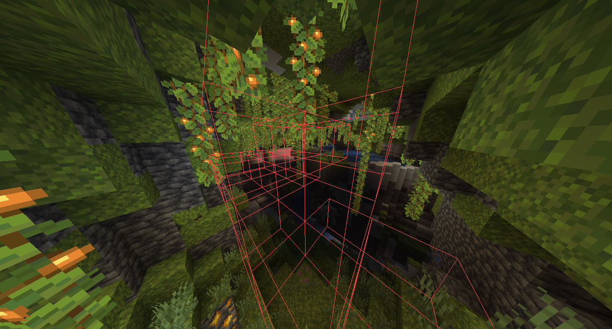

# Big Caves Addon

Enhance your cave exploration experience in Meteor Client with powerful tools designed to help you find and visualize valuable ores and large cave systems.

---

### 1. Big Caves Finder

This module is engineered to discover massive cave systems with minimal impact on game performance. It uses a multi-threaded scanning process to analyze the world around the player for large, open subterranean spaces.

#### Key Features:
-   **Optimized Cave Detection:** Employs a highly-optimized, multi-threaded algorithm to scan for caves without causing significant lag or stutter.
-   **Configurable Scanning Area:**
    -   **Horizontal & Vertical Radius:** Customize the distance the module scans around the player, both horizontally and vertically.
    -   **Max Scan Height:** Set a Y-level limit to prevent scanning in unwanted areas (e.g., above ground).
-   **Intelligent Scanning:**
    -   **Chunk-Based Analysis:** Divides the scan area into manageable volumes and only scans chunks that are fully loaded, preventing incomplete data.
    -   **Air Block Thresholds:** Define the minimum number of air blocks required within a volume (`min-air-blocks`) and the minimum number of *connected* air blocks (`min-connected-air`) to qualify as a "big cave." This ensures it only finds genuinely large systems.
    -   **Performance Caching:** Remembers recently scanned areas to avoid redundant checks, improving efficiency.
    -   **Quick Air Estimation:** Uses a sampling method to quickly discard solid areas before performing a full block count.
-   **Safety Limits:** Implements a node limit for its connectivity search (flood-fill) to prevent excessive processing, with different limits for single-player and multiplayer to ensure stability.
-   **Customizable Rendering:**
    -   **ESP Box:** Highlights found cave systems with a configurable colored box.
    -   **Render Modes:** Choose between rendering the outline, the fill, or both (`ShapeMode`).
    -   **Color Settings:** Pick any color and transparency for the ESP.

#### How It Works:
The module scans in cubic volumes around the player. It first estimates if a volume contains a significant amount of air. If it does, it performs a more detailed count. If the air block count surpasses the `min-air-blocks` threshold, it then initiates a bounded flood-fill from the center of that volume to count how many of those air blocks are connected. If this connected count exceeds the `min-connected-size` threshold, the area is marked as a "big cave" and highlighted.

---

### 2. Ore ESP

This module scans for and highlights specified ores that are exposed to air, making it easy to spot valuable resources in caves and ravines. It is designed to integrate seamlessly with the `BigCavesFinder` for maximum efficiency.

#### Key Features:
-   **Multiple Scan Modes:**
    -   **`Around Player`:** Scans in a configurable radius around the player's current position.
    -   **`BigCaves`:** An efficient mode that only scans inside the large cave systems identified by the `BigCavesFinder` module.
    -   **`Both`:** Combines both methods for the most comprehensive coverage.
-   **Performance-First Design:**
    -   **Multi-Threaded Scanning:** All scanning operations run on a separate thread to ensure smooth gameplay.
    -   **Configurable Scan Delay:** Adjust the time between scans to balance performance and real-time updates.
    -   **Automatic Cleanup:** Ores that are too far away (`despawn-distance`) or have been mined are automatically removed from the ESP.
-   **Smart Ore Detection:**
    -   **Exposed Ores Only:** The module specifically looks for ore blocks that are adjacent to an air block (`isExposed`), meaning you only see ores you can actually get to.
    -   **Vein Finding:** When an exposed ore is found, the module quickly scans its immediate neighbors to find and highlight the entire exposed part of the vein.
-   **Advanced Rendering & Visibility:**
    -   **Dual-Color ESP:**
        -   **Visible Color:** A distinct color for ores that are in your direct line of sight.
        -   **Hidden Color:** A different color for ores that are exposed but currently obscured by other blocks.
    -   **Visibility Cache:** Uses an efficient ray-tracing cache to determine if an ore is visible, reducing the computational load of line-of-sight checks.
    -   **Customizable Shapes & Colors:** Full control over the render mode (`ShapeMode`) and colors for both visible and hidden ores.
-   **User-Friendly Features:**
    -   **Customizable Ore List:** Easily add or remove any block from the list of ores to search for.
    -   **Chat Notifications:** Optional in-game chat messages to alert you when a new ore vein is discovered.
    -   **On-Screen Info:** Displays the total count of currently highlighted ores.

## Screenshots

CaveFinder

OreEsp and CaveFinder

OreEsp and CaveFinder

---

## Installation

1. Download the latest release of the Big Caves Addon `.jar` file.
2. Place the `.jar` file into your Meteor Client `addons` folder.
3. Launch Minecraft with Meteor Client installed.
4. Enable the Big Caves modules from the Meteor Client modules list.

---

## Usage

- Open the Meteor Client GUI.
- Navigate to the **Cave Tools** category.
- Enable **BigCavesFinder** or **OreEsp** modules as needed.
- Configure module settings to suit your preferences.

---

## Requirements

- Minecraft 1.21.6, 1.21.7, or compatible versions.
- Java 21 or newer.
- Meteor Client installed.

Enjoy exploring those big caves!
